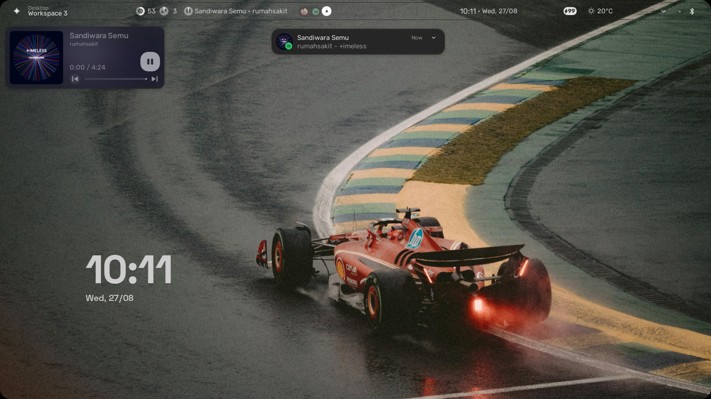

# 📦 Custom Quickshell For Hyprland — *illogical-impulse* 🚀  

  
  
  
  
  

> Keep your Quickshell fresh, clean & fast 🔥  

---

## 📝 Info
- **Name:** Custom Quickshell  
- **Description:** Config yang bisa langsung dipaste/replace di `.config` ✨  

---

## 📦 Requirements
- **Hyprland — illogical-impulse** 🖥️  
- **All Linux Distro** 🐚  

---

## ⚡ Usage
### 1. Install Illogical-impulse

- install = https://github.com/end-4/dots-hyprland

### 2. . Backup sebelum replace

- example = mv /to/path/.config/quickshell/  /to/path/.config/quickshell.Backup/

### 3. Replace all .config to your directory, If you use a network manager like in KDE or Gnome, please see [Tips Network Manager]

- example = cp /to/path/Downloads/quickshell/  /to/path/.config/quickshell/

## 🔧[TIPS ENABLE NETWORK]

- Remove Folder quickshell/ii/modules/bar From the zip you get 🛠️
- Or Replace modules bar default to quickshell custom 💡

---

## ✨ Features
- Simple Control Music and Minimalist ✨
- Notification is in the middle 📜
- Nothing has changed again from the default there 🛠️
- If you use the [Network Manager Base KDE, Gnome, etc] you can activate / Remove bar in quicshell/ii/modules 💡
- Tested on Arch Linux & other distros 🐧
---

## 👀 View
  

---

## 📜 License
MIT License — use, modify, share freely 📜

---

## 👤 Author
**Fbrnsyh**  

---

## 🔗 Source
- [end-4/dots-hyprland](https://github.com/end-4/dots-hyprland)  
- [Hyprland](https://hypr.land/)  

---

## 💡 Quote
> *"Keep your tools sharp, your code clean, and your mind open."*  
